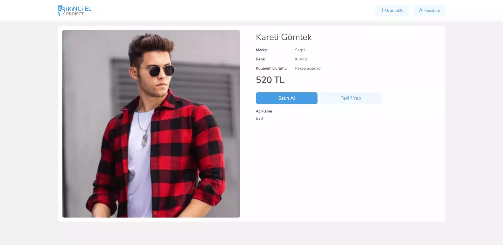
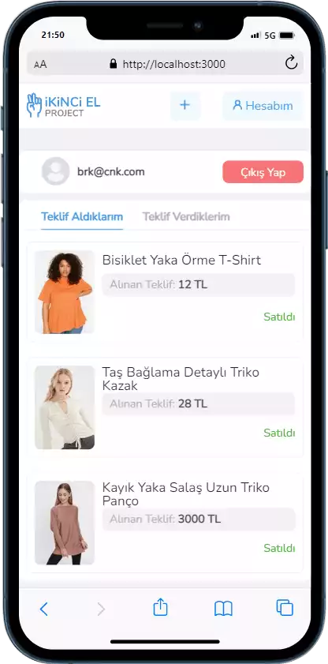
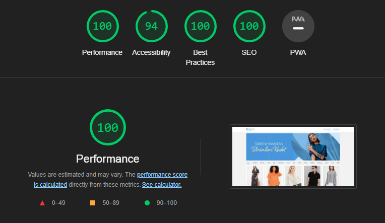
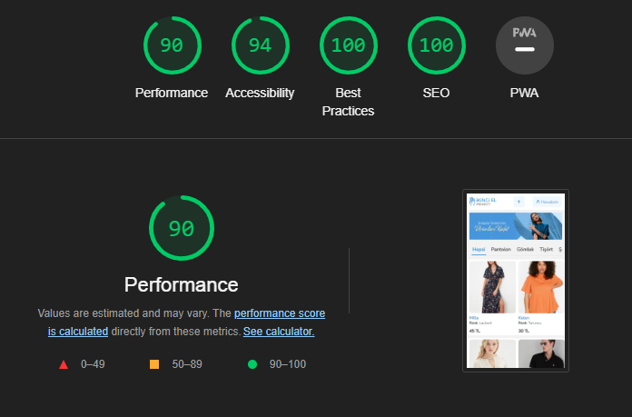

<div align='center'>
    <div>
        
        
        
    </div>
    <br/>
    <br/>
    


</div>

<br/>
<br/>

It is the graduation project of React bootcamp, which is realized in cooperation with Protein' tech and Patika.dev.

You can access the live demo from the link here: [ <b> Live Demo</b> ](https://protein-patika-graduation-burak-caniklioglu.netlify.app/) 

## Content

- [About](#about)
- [Used Packages And Modules](#used-packages-and-modules)
- [Installation](#installation)
- [Previews](#previews)
- [App Performance](#app-performance)

<br>

# About
- Second Hand Project is an e-commerce site that provides its users with the functionality to add, buy and sell products.

- Users can directly purchase the products, as well as bid on the products that are open to offers, or open the products they own to offer.

- In the bidding section, the highest bid was taken into consideration. If the seller approves the offer, the product becomes cannot be offered. In this way, the product is sold  to the person with the direct price or the highest offer.

- If the seller rejects the highest bid, the product offer is shown as rejected in the vendor panel unless there is a higher bid than it. The purpose here is interpreted as the seller expects a higher offer.

- The product owner cannot buy or bid on her/his own product.

- If you already have an account, you can log in or use the site by registering.

- The application is designed for web and mobile. All UI designs are responsive.

<br>

## Used Packages And Modules

- React JS
- Context Api
- Axios
- Js-cookie
- Airbnb Eslint
- SASS
- Formik
- Yup
- Ant Design Upload
- Toastify
- Cypress
- Netlify

<br>

## Installation

- First, clone the project:

```
git clone https://github.com/burak-caniklioglu/ikinci-el-project.git
```

- Then, start the project on localhost:

```
# install dependencies with npm
npm install
# or install dependencies with yarn
yarn install

# serve at localhost:3000
npm start or yarn start
```

```
# test
yarn run cypress open
'click' ikinciElLoginRegister.test.js
```
# Previews

<center>

## Web - Login Page


## Web - Register Page


## Web - Main Page


## Web - Detail Page



## Web - Add Product Page


## Web - Account Page


## Mobile

<p align="center">
    
    
    
    
    
    
</p>
</center>

<br>
<br>

# App Performance

## Web

<p align="center">

  
</p>

## Mobile

<p align="center">

  
</p>
